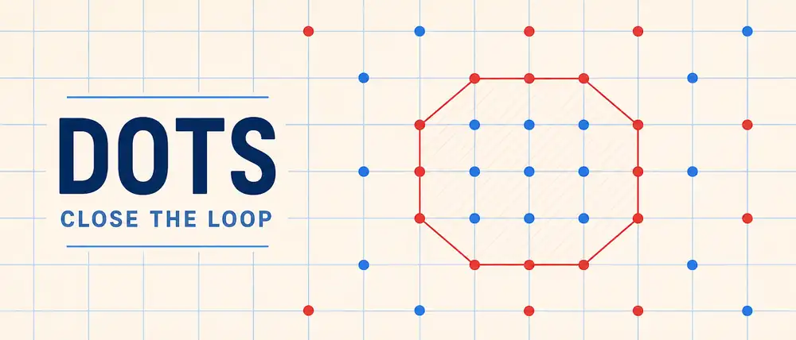

<div align="center">

# 🔴·🔵 DOTS

### SURROUND · CAPTURE · CONTROL



[](https://github.com/StanleyLl0yd/dots/actions/workflows/ci.yml)
[](https://stanleyll0yd.github.io/dots/)
[](https://stanleyll0yd.github.io/dots/)
[](https://www.typescriptlang.org/)
[](package.json)
[](LICENSE)

[](README.md)
[](README_RU.md)

A minimalist digital version of the classic **Dots / Tochki** surround-and-capture strategy game.

[**▶ Open current web build**](https://stanleyll0yd.github.io/dots/)

</div>

**Dots** turns squared paper and two colored pens into a clean browser game. Players alternate placing dots on grid intersections. When a valid neighboring-dot boundary is actually closed around opponent dots, the captured area is outlined and lightly hatched.

Current source version: **0.2.0** · advanced capture rules · Web + PWA · GitHub Pages live

## 🎯 Rules

1. Red moves first by default.
2. Players alternate placing one dot on a legal empty grid intersection.
3. Every two consecutive dots of a boundary must be on neighboring grid intersections: exactly one grid step horizontally, vertically, or diagonally. Gaps and long segments are not allowed.
4. The last boundary dot must also be adjacent to the first, forming a closed chain.
5. A closed chain captures when it encloses at least one opponent dot.
6. Captured opponent dots count toward the surrounding player's score.
7. A closed empty area is a **house** and does not score while empty. If the opponent enters it without completing a direct capture on that move, the house activates as a capture.
8. Active opponent captures can themselves be surrounded. A fully surrounded opponent capture is deactivated, its previously captured dots are released, and score is recalculated from the active capture state.
9. The player with more currently captured opponent dots has the higher score.

The authoritative rules and implementation status are tracked in [`docs/PRODUCT.md`](docs/PRODUCT.md).

## ✨ Current build

- TypeScript game core separated from Canvas rendering;
- local two-player placement on grid intersections;
- real closed-enclosure detection using neighboring dots in 8 directions;
- rejection of open contours and empty houses as scored captures;
- house activation when an opponent enters an empty house without completing a direct capture;
- multiple independent captures completed by one move;
- deterministic minimum-face selection when several valid boundaries compete;
- capture-of-capture with deactivation of fully surrounded opponent captures and release of previously captured own dots;
- score derived from active captured dots rather than an irreversible counter;
- captured areas blocked from further placement;
- capture outline, translucent fill, and light diagonal hatching;
- Russian UI when Russian is present in browser/system locales, English otherwise;
- responsive desktop/mobile layout with light and dark presentation;
- installable PWA and offline-ready build pipeline;
- Vitest topology/regression tests, CI, and automatic GitHub Pages deployment;
- proprietary All Rights Reserved license.

Version **0.2.0** establishes the advanced local capture rules. Remaining rule-engine work is focused on adversarial self-touching/crossing topologies and broader stress coverage rather than the main house/release flow.

## 🧱 Technology

| Category | Technology |
| --- | --- |
| Language | TypeScript 5.9 |
| Rendering | HTML5 Canvas |
| Build | Vite 7 |
| PWA | vite-plugin-pwa / Workbox |
| Tests | Vitest |
| Persistence | not yet implemented |
| Hosting | GitHub Pages |
| CI/CD | GitHub Actions |

## 🗂 Architecture

```text
src/
├── game/
│   ├── board.ts           game state and legal placement
│   ├── board.test.ts      move/capture integration tests
│   ├── capture.ts         topology, house, release, and scoring logic
│   ├── capture.test.ts    capture-geometry regression tests
│   └── types.ts           domain types
├── ui/
│   └── canvas-board.ts    Canvas rendering and pointer input
├── i18n.ts                Russian / English interface
├── i18n.test.ts           locale tests
├── main.ts                application composition
└── styles.css             notebook-inspired visual layer
```

See [`docs/ARCHITECTURE.md`](docs/ARCHITECTURE.md) for the current capture-engine architecture and [`CHANGELOG.md`](CHANGELOG.md) for release changes.

## 🛠 Development

Requirements: Node.js 22+ and npm.

```bash
git clone https://github.com/StanleyLl0yd/dots.git
cd dots
npm install
npm run dev
```

Verification:

```bash
npm test
npm run build
```

## 🗺 Roadmap

1. Harden rare self-touching, crossing-edge, and competing-boundary topologies with additional regression and stress tests.
2. Add new game, confirmation flow, undo, and versioned local persistence.
3. Add board panning/zooming and polished mouse/touch gestures for a practically unbounded play area.
4. Stabilize PWA/offline behavior across desktop and mobile browsers.
5. Consider AI only after the local rules engine and game-state history are proven.
6. Optionally package the same codebase for Android through Capacitor later.

## 📄 License

Copyright © 2026 **Stanley Lloyd**. All rights reserved.

This repository is publicly visible for source inspection. Public availability **does not grant permission** to copy, modify, adapt, translate, distribute, publish, mirror, create derivative works, incorporate the code into another product, or otherwise reuse repository contents.

Only end-user use of the officially hosted Dots application is permitted. Any other use requires prior written permission from the copyright holder. See [`LICENSE`](LICENSE) for the authoritative terms.

## 👨‍💻 Author

**Stanley Lloyd** · [@StanleyLl0yd](https://github.com/StanleyLl0yd)

---

<div align="center">

**🔴 · 🔵 · CLOSE THE LOOP**

</div>
