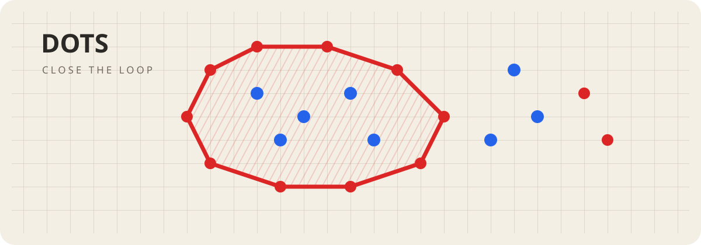

<div align="center">

# 🔴·🔵 ТОЧКИ

### ОКРУЖАЙ · ЗАХВАТЫВАЙ · КОНТРОЛИРУЙ



[](https://github.com/StanleyLl0yd/dots/actions/workflows/ci.yml)
[](https://stanleyll0yd.github.io/dots/)
[](https://stanleyll0yd.github.io/dots/)
[](https://www.typescriptlang.org/)
[](package.json)
[](LICENSE)

[](README.md)
[](README_RU.md)

Минималистичная цифровая версия классической стратегической игры **«Точки»**.

[**▶ Открыть текущую веб-версию**](https://stanleyll0yd.github.io/dots/)

</div>

**Точки** переносят лист бумаги в клетку и две цветные ручки в браузер. Игроки по очереди ставят точки на пересечения сетки. Замкнутая цепь своих точек захватывает точки соперника внутри и закрепляет окружённую область.

Текущая версия исходников: **0.1.0** · фундамент репозитория · Web + PWA · GitHub Pages опубликован

## 🎯 Правила

1. По умолчанию первыми ходят красные.
2. Игроки по очереди ставят по одной точке на свободное разрешённое пересечение сетки.
3. Точки одного цвета соединяются по горизонтали, вертикали и диагонали.
4. Замкнутая цепь становится окружением, если внутри находится хотя бы одна точка соперника.
5. Захваченные точки соперника идут в счёт окружившему игроку.
6. Замкнутая пустая область — **домик**, а не результативное окружение.
7. Области окружения можно окружать снова, освобождая ранее захваченные свои точки.
8. Преимущество определяется количеством точек соперника, которые остаются захваченными в текущем состоянии игры.

Полная спецификация правил и спорных случаев находится в [`docs/PRODUCT.md`](docs/PRODUCT.md).

## ✨ Что уже подготовлено

- основа игрового ядра на TypeScript;
- поле на HTML5 Canvas;
- стартовая локальная расстановка точек для двух игроков;
- русский интерфейс, если русский присутствует среди языков браузера/системы, иначе английский;
- адаптивная компоновка для компьютеров и мобильных устройств;
- светлое и тёмное оформление;
- основа устанавливаемого PWA;
- сборка с подготовкой к офлайн-работе;
- Vitest;
- CI для push и pull request;
- автоматический workflow публикации в GitHub Pages;
- закрытая proprietary-лицензия All Rights Reserved;
- документация по архитектуре и будущему алгоритму окружений.

Алгоритм окружений намеренно сначала зафиксирован в спецификации: именно топология окружений — наиболее критичная для корректности часть игры.

## 🧱 Технологии

| Категория | Технология |
| --- | --- |
| Язык | TypeScript 5.9 |
| Отрисовка | HTML5 Canvas |
| Сборка | Vite 7 |
| PWA | vite-plugin-pwa / Workbox |
| Тесты | Vitest |
| Хранение | localStorage планируется |
| Хостинг | GitHub Pages |
| CI/CD | GitHub Actions |

## 🗂 Архитектура

```text
src/
├── game/
│   ├── board.ts           состояние поля и занятость точек
│   ├── board.test.ts      тесты игрового ядра
│   └── types.ts           типы предметной области
├── ui/
│   └── canvas-board.ts    Canvas и обработка ввода
├── i18n.ts                русский / английский интерфейс
├── i18n.test.ts           тесты локали
├── main.ts                сборка приложения
└── styles.css             оформление в стиле тетрадного поля
```

Проектирование механики окружений: [`docs/ARCHITECTURE.md`](docs/ARCHITECTURE.md).

## 🛠 Разработка

Требования: Node.js 22+ и npm.

```bash
git clone https://github.com/StanleyLl0yd/dots.git
cd dots
npm install
npm run dev
```

Проверка:

```bash
npm test
npm run build
```

## 🗺 План

1. Полностью реализовать и протестировать классический алгоритм окружений.
2. Добавить домики, вложенные окружения, освобождение точек и пересчёт счёта.
3. Добавить перемещение/масштабирование поля, сохранение партии, отмену хода и полноценное управление касаниями.
4. Довести PWA и офлайн-режим и выпустить первую полную веб-версию.
5. Возвращаться к ИИ только после стабилизации правил.
6. Позже при необходимости упаковать ту же кодовую базу для Android через Capacitor.

## 📄 Лицензия

Copyright © 2026 **Stanley Lloyd**. Все права защищены.

Репозиторий открыт для просмотра исходного кода. Публичная доступность **не даёт разрешения** копировать, изменять, адаптировать, переводить, распространять, публиковать, зеркалировать, создавать производные работы, включать код в другие продукты или иным образом повторно использовать содержимое репозитория.

Разрешено только использование официально опубликованного приложения конечным пользователем. Любое другое использование требует предварительного письменного разрешения правообладателя. Юридически значимый текст находится в [`LICENSE`](LICENSE).

## 👨‍💻 Автор

**Stanley Lloyd** · [@StanleyLl0yd](https://github.com/StanleyLl0yd)

---

<div align="center">

**🔴 · 🔵 · ЗАМКНИ КОНТУР**

</div>
